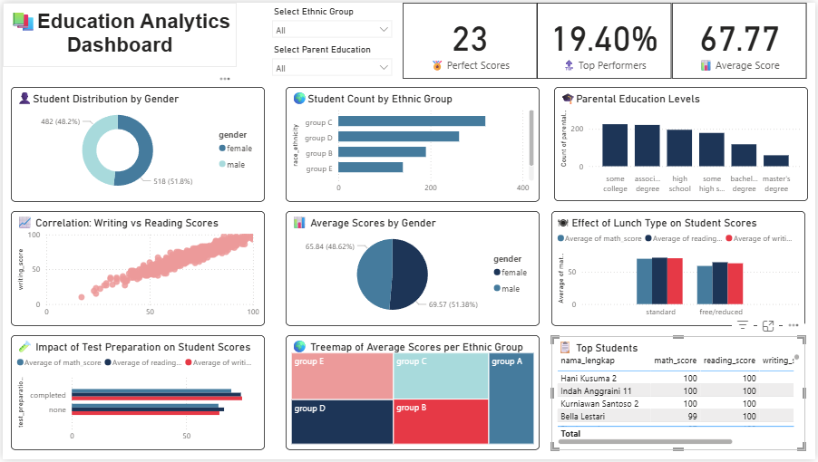

# 📊 **Education Analytics Dashboard**


---

## 📂 **Overview**

The **Education Analytics Dashboard** provides an interactive analysis of student performance by integrating demographic, academic, and socioeconomic factors. This project aims to uncover patterns that influence student achievement and highlight actionable insights for improving learning outcomes.

The dashboard was designed with a focus on:

* **Equity in education**: identifying disparities in performance.
* **Data-driven insights**: supporting educators and policymakers with evidence.
* **Ease of use**: interactive filters and visuals for exploration.

---

## 🎯 **Key Features**

* **Student Demographics**

  * Distribution by gender and ethnic group.
  * Parent education levels and their impact on performance.

* **Performance Metrics**

  * Correlation between writing and reading scores.
  * Comparison of average scores across gender and ethnic groups.
  * Effect of lunch type and test preparation on academic outcomes.

* **Highlights**

  * **23 perfect scores** identified.
  * **Top 19.4% performers** spotlighted.
  * **Average score of 67.77** across all students.

* **Drill-down Views**

  * Treemap of average scores by ethnic group.
  * Top student rankings with detailed scores.

---

## 🖼️ **Dashboard Preview**



---

## 🔍 **Insights**

* **Gender Distribution**:

  * Female students: **482 (48.2%)**, average score **65.84**.
  * Male students: **518 (51.8%)**, average score **69.57**.
    → Males slightly outperform females in average scores.

* **Ethnic Group**:

  * Group C has the largest count (**319 students**) with consistently higher average scores compared to other groups.
  * Group A and Group D follow, while Group B is the smallest.

* **Parental Education Levels**:

  * Majority of parents fall under **some college (226)** and **associate degree (222)** categories.
  * **High school** and **bachelor’s degree** groups also contribute significantly, with **196** and **118** parents respectively.
  * **Master’s degree** is the least represented group (under 100).
    → This chart shows the **distribution of parental education levels**, not student performance. It highlights that most students come from families with mid-level education backgrounds.

* **Correlation (Writing vs Reading)**:

  * Strong positive relationship: students scoring **>80 in reading** typically achieve **>80 in writing**.

* **Impact of Test Preparation**:

  * Completed preparation → average math score **69.7**, reading **73.89**, writing **74.42**.
  * No preparation → average math score **64.08**, reading **66.53**, writing **64.5**.
    → Test prep increases performance by **5–10 points across all subjects**.

* **Effect of Lunch Type**:

  * Standard lunch: average scores **\~70 across subjects**.
  * Free/reduced lunch: average scores drop to **\~58–64**.
    → A clear gap of **6–12 points**, showing socioeconomic influence.

* **Top Students**:

  * Best performer: **Hani Kusuma, Indah Anggraini and Kurniawan Santoso (Math 100, Reading 100, Writing 100)**.
  * Several students achieved multiple **perfect scores (100)** across subjects.
  * Multiple students achieved perfect scores across subjects, demonstrating outstanding academic performance.

---

## ⚙️ **Tools & Technologies**

* **Power BI** → Data modeling and interactive visualization.
* **Excel / CSV** → Dataset preprocessing and cleaning.
* **DAX (Data Analysis Expressions)** → Custom calculations and KPIs.

---

## 🚀 **Reproducibility**

1. Clone this repository:

   ```bash
   git clone https://github.com/username/education-analytics-dashboard.git
   ```
2. Open the `.pbix` file in Power BI Desktop.
3. Load the dataset (`students_performance.csv` or equivalent).
4. Refresh the dashboard to interact with the data.

---
